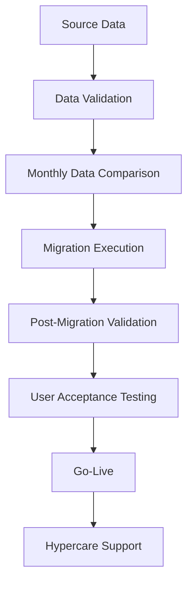

# Oracle EBS to Oracle Fusion Migration Case Study

## Project Overview

The organization initiated the migration from Oracle EBS to Oracle Fusion to modernize its HR systems and support global HR operations through a cloud-based platform.

The migration aimed to standardize HR processes across regions, improve reporting capabilities, enhance the user experience and streamline employee lifecycle management.

In our implementation, employee documents were maintained in separate regional shared drives outside the HR system. Oracle Fusion provided a more integrated approach to managing employee records and supporting documents within our implementation, helping reduce manual effort and improve process visibility.

The new platform also introduced structured workflows for onboarding, offboarding and other HR processes, making the overall employee lifecycle more systematic and efficient.

## Business Objective

The primary objective of the migration was to modernize the organization's HR operations by moving from a legacy on-premise system to a cloud-based HR platform.

From a business perspective, the migration focused on:

- Standardizing HR processes across global regions through a single platform.
- Reducing manual effort by introducing automated workflows and approval notifications.
- Improving employee and manager experience through a modern and user-friendly interface with self-service capabilities.
- Enhancing reporting capabilities and creating a stronger foundation for future HR analytics.
- Centralizing HR information and reducing dependency on multiple external tools and regional document repositories.
- Supporting the organization's digital transformation while reducing infrastructure and maintenance overhead associated with on-premise systems.
## My Role

As an HRIS Project Team member, I supported multiple phases of the Oracle EBS to Oracle Fusion migration, including data validation, User Acceptance Testing (UAT), stakeholder coordination, end-user training and post go-live support.

My key responsibilities included:

### Before Migration
- Validated employee master data in the source system before migration.
- Identified duplicate employee records, missing information and data inconsistencies.
- Verified reporting managers, employee details and organizational data.
- Performed regular data quality checks to ensure migration readiness.
- Compared monthly source data to identify changes and validate business transactions before migration.

### Migration & UAT
- Participated in solution walkthrough sessions conducted by Oracle consultants.
- Supported validation of HR business processes during system configuration.
- Executed User Acceptance Testing (UAT) for employee lifecycle transactions.
- Tested approval workflows, email notifications and HR process journeys.
- Logged defects, tracked observations and coordinated with Oracle consultants for issue resolution.
- Participated in regular project meetings to review progress, discuss issues and monitor project status.

### Go-Live Preparation
- Supported final validation activities before production deployment.
- Participated in transaction freeze activities before go-live.
- Maintained a tracker for business transactions performed during the freeze period.
- Conducted knowledge-sharing sessions for HR teams before production deployment.

### Post Go-Live Support
- Validated migrated employee data after go-live.
- Entered business transactions captured during the freeze period.
- Prepared user manuals for HR teams and hiring managers.
- Supported HR users during the hypercare phase by resolving process-related queries.
- Conducted regular follow-up sessions with global HR teams to monitor pending tasks and improve user adoption.

## Migration Process

The Oracle EBS to Oracle Fusion migration followed a structured implementation approach to ensure data accuracy, business continuity and a smooth transition to the new HR system.

The project was executed in the following phases:

### 1. Source Data Validation
- Validated employee master data before migration.
- Identified duplicate records, missing information and data inconsistencies.
- Verified reporting managers, employee details and organizational hierarchy.
- Performed regular data quality checks to improve migration readiness.

### 2. Data Comparison & Change Validation
- Compared monthly source data with previously validated data.
- Verified that new hires, transfers, manager changes and other business transactions were accurately reflected.
- Ensured source data remained consistent before migration execution.

### 3. Migration Execution
- The validated data was migrated from Oracle EBS to Oracle Fusion.
- Business transactions were temporarily frozen before production migration to maintain data consistency.
- All transactions performed during the freeze period were tracked separately for later processing.

### 4. Post-Migration Validation
- Downloaded and validated migrated employee data.
- Compared migrated records with the source system to ensure data accuracy.
- Verified employee information, reporting relationships and organizational structure after migration.

### 5. User Acceptance Testing (UAT)
- Executed end-to-end testing for HR business processes.
- Tested employee lifecycle transactions, approval workflows and email notifications.
- Logged observations and defects in the project tracker.
- Coordinated with Oracle consultants for issue resolution.

### 6. Go-Live
- Conducted knowledge-sharing sessions for HR teams before production deployment.
- Supported production go-live activities.
- Entered business transactions captured during the freeze period.

### 7. Hypercare Support
- Assisted HR teams after go-live.
- Resolved user queries and process-related issues.
- Shared user manuals and process documentation.
- Conducted regular follow-up sessions to improve user adoption and monitor pending activities.

## Data Validation

## User Acceptance Testing (UAT)

## Post Go-Live Support

## Challenges Faced

## Key Learnings
