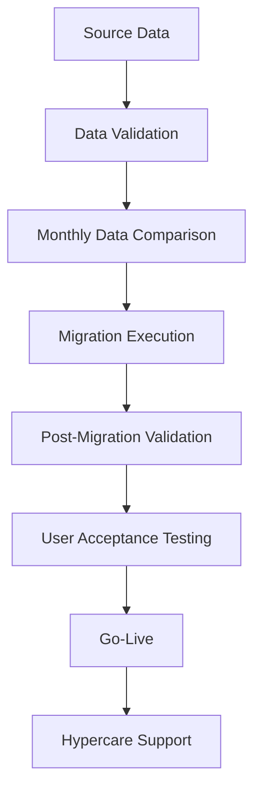

# Oracle EBS to Oracle Fusion Migration Case Study

## Project Overview

The organization initiated the migration from Oracle EBS to Oracle Fusion to modernize its HR systems and support global HR operations through a cloud-based platform.

The migration aimed to standardize HR processes across regions, improve reporting capabilities, enhance the user experience and streamline employee lifecycle management.

In our implementation, employee documents were maintained in separate regional shared drives outside the HR system. Oracle Fusion provided a more integrated approach to managing employee records and supporting documents within our implementation, helping reduce manual effort and improve process visibility.

The new platform also introduced structured workflows for onboarding, offboarding and other HR processes, making the overall employee lifecycle more systematic and efficient.

## Business Objective

The primary objective of the migration was to modernize the organization's HR operations by moving from a legacy on-premise system to a cloud-based HR platform.

From a business perspective, the migration focused on:

- Standardizing HR processes across global regions through a single platform.
- Reducing manual effort by introducing automated workflows and approval notifications.
- Improving employee and manager experience through a modern and user-friendly interface with self-service capabilities.
- Enhancing reporting capabilities and creating a stronger foundation for future HR analytics.
- Centralizing HR information and reducing dependency on multiple external tools and regional document repositories.
- Supporting the organization's digital transformation while reducing infrastructure and maintenance overhead associated with on-premise systems.

## My Role

As an HRIS Project Team member, I supported multiple phases of the Oracle EBS to Oracle Fusion migration, including data validation, User Acceptance Testing (UAT), stakeholder coordination, end-user training and post go-live support.

My key responsibilities included:

### Before Migration
- Validated employee master data in the source system before migration.
- Identified duplicate employee records, missing information and data inconsistencies.
- Verified reporting managers, employee details and organizational data.
- Performed regular data quality checks to ensure migration readiness.
- Compared monthly source data to identify changes and validate business transactions before migration.

### Migration & UAT
- Participated in solution walkthrough sessions conducted by Oracle consultants.
- Supported validation of HR business processes during system configuration.
- Executed User Acceptance Testing (UAT) for employee lifecycle transactions.
- Tested approval workflows, email notifications and HR process journeys.
- Logged defects, tracked observations and coordinated with Oracle consultants for issue resolution.
- Participated in regular project meetings to review progress, discuss issues and monitor project status.

### Go-Live Preparation
- Supported final validation activities before production deployment.
- Participated in transaction freeze activities before go-live.
- Maintained a tracker for business transactions performed during the freeze period.
- Conducted knowledge-sharing sessions for HR teams before production deployment.

### Post Go-Live Support
- Validated migrated employee data after go-live.
- Entered business transactions captured during the freeze period.
- Prepared user manuals for HR teams and hiring managers.
- Supported HR users during the hypercare phase by resolving process-related queries.
- Conducted regular follow-up sessions with global HR teams to monitor pending tasks and improve user adoption.

## Migration Process

The Oracle EBS to Oracle Fusion migration followed a structured implementation approach to ensure data accuracy, business continuity and a smooth transition to the new HR system.

The project was executed in the following phases:

### 1. Source Data Validation
- Validated employee master data before migration.
- Identified duplicate records, missing information and data inconsistencies.
- Verified reporting managers, employee details and organizational hierarchy.
- Performed regular data quality checks to improve migration readiness.

### 2. Data Comparison & Change Validation
- Compared monthly source data with previously validated data.
- Verified that new hires, transfers, manager changes and other business transactions were accurately reflected.
- Ensured source data remained consistent before migration execution.

### 3. Migration Execution
- The validated data was migrated from Oracle EBS to Oracle Fusion.
- Business transactions were temporarily frozen before production migration to maintain data consistency.
- All transactions performed during the freeze period were tracked separately for later processing.

### 4. Post-Migration Validation
- Downloaded and validated migrated employee data.
- Compared migrated records with the source system to ensure data accuracy.
- Verified employee information, reporting relationships and organizational structure after migration.

### 5. User Acceptance Testing (UAT)
- Executed end-to-end testing for HR business processes.
- Tested employee lifecycle transactions, approval workflows and email notifications.
- Logged observations and defects in the project tracker.
- Coordinated with Oracle consultants for issue resolution.

### 6. Go-Live
- Conducted knowledge-sharing sessions for HR teams before production deployment.
- Supported production go-live activities.
- Entered business transactions captured during the freeze period.

### 7. Hypercare Support
- Assisted HR teams after go-live.
- Resolved user queries and process-related issues.
- Shared user manuals and process documentation.
- Conducted regular follow-up sessions to improve user adoption and monitor pending activities.

## Data Validation

Data validation was one of the most critical phases of the migration project. The objective was to ensure that only accurate and complete employee data was migrated to Oracle Fusion.

- Validated employee master data before migration.
- Verified reporting managers, employee information and organizational hierarchy.
- Identified duplicate employee records and missing mandatory information.
- Compared monthly source data to identify business changes before migration.
- Verified that employee transactions were accurately reflected before migration.
- Performed post-migration validation by comparing migrated data with the source system.
- Coordinated with stakeholders to resolve data discrepancies before production deployment.

## User Acceptance Testing (UAT)

User Acceptance Testing (UAT) was performed to verify that Oracle Fusion supported the organization's HR business processes before production deployment.

My responsibilities included:

- Executed end-to-end testing for employee lifecycle transactions.
- Tested onboarding, offboarding, transfers, reporting manager updates and other HR business processes.
- Verified approval workflows and system-generated email notifications.
- Logged defects and observations in the UAT tracker.
- Coordinated with Oracle consultants to discuss issues and validate fixes.
- Performed re-testing after fixes were deployed.
- Participated in regular project review meetings during the UAT phase.

## Post Go-Live Support

Post go-live support focused on ensuring a smooth transition for HR teams after the production deployment of Oracle Fusion.

- Validated employee data after production deployment.
- Entered business transactions captured during the freeze period.
- Prepared and shared user manuals with HR teams and hiring managers.
- Supported HR users during the hypercare phase by resolving process-related queries.
- Monitored system task journeys assigned to global HR teams to ensure timely completion.
- Generated weekly reports to track pending HR tasks and user activities.
- Conducted fortnightly follow-up meetings with global HR teams to review incomplete tasks, clarify process-related queries and improve system adoption.
- Coordinated with HR teams to ensure Hire-to-Retire transactions and other system activities were completed within the expected timelines.
- Escalated unresolved issues to Oracle consultants or internal stakeholders whenever additional investigation was required.

## Challenges Faced

During the implementation, the project team encountered several practical challenges that required close coordination between HR, business stakeholders and Oracle consultants.

### 1. Managing Multiple Activities Simultaneously

One of the biggest challenges was balancing multiple implementation activities at the same time. While source data validation and migration preparation were in progress, User Acceptance Testing (UAT) also had to be executed in parallel using test data. Careful planning and coordination were required to ensure that both activities progressed without affecting the overall project timeline.

### 2. Data Quality and Migration Readiness

Maintaining high data quality before migration was another key challenge. Duplicate records, missing mandatory information and data inconsistencies had to be identified and resolved before production migration to ensure accurate data transfer into Oracle Fusion.

### 3. User Adoption and Change Management

Moving from a legacy system to Oracle Fusion required HR teams to adapt to new processes and workflows. Some users were initially more comfortable with the previous system, making user adoption a challenge. Training sessions, user manuals, regular follow-up meetings and continuous support helped improve confidence and adoption of the new system.

## Key Learnings

This project was my first large-scale HRIS implementation experience, and it gave me practical exposure to the complete implementation lifecycle. Some of my key learnings include:

- Learned how to validate, analyse and correct employee master data before migration to ensure data accuracy.
- Developed a strong understanding of how enterprise HR data should be structured and represented within an HRIS.
- Learned how User Acceptance Testing (UAT) is performed using test environments and dummy data before deploying changes into production.
- Understood the importance of testing every business process in a non-production environment before implementing it in the live system.
- Improved my ability to manage multiple project activities simultaneously, including data validation, migration support and UAT execution.
- Learned how to maintain project trackers, monitor daily progress and follow up on pending actions throughout the implementation.
- Developed experience in identifying issues, coordinating with Oracle consultants and tracking them until resolution.
- Improved stakeholder communication by working closely with HR teams, managers, business users and Oracle consultants across different regions.
- Learned that the success of an HRIS implementation depends not only on technology but also on teamwork, collaboration, documentation and continuous user support.

## Reflection

This project was a turning point in my HR career. As a fresher, I had limited exposure to enterprise HRIS implementations, but working on the Oracle EBS to Oracle Fusion migration helped me understand how large-scale HR transformation projects are executed.

Beyond learning technical concepts such as data validation, UAT and post go-live support, I also learned the importance of planning, stakeholder communication, teamwork and continuous user support. This experience built the foundation of my interest in HRIS, HR technology and digital transformation.

## Conclusion

The Oracle EBS to Oracle Fusion migration project provided practical exposure to enterprise HRIS implementation, including data validation, User Acceptance Testing (UAT), production deployment and post go-live support. The project strengthened my technical understanding of HR systems while also improving my stakeholder management, problem-solving and project coordination skills.
