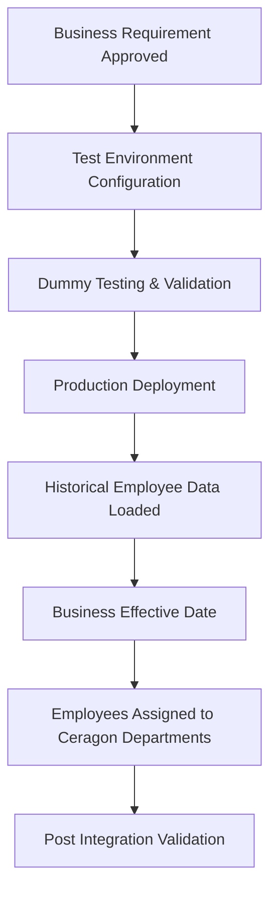

# Siklu Acquisition HR Integration

## Project Overview

Following Ceragon's acquisition of Siklu, the HR project team was responsible for integrating Siklu employees into Ceragon's HR system while preserving their historical employment records.

The primary objective of the project was to ensure that acquired employees became part of Ceragon's organizational structure without losing historical employee information that might be required for reporting, auditing or future reference.

To achieve this, a dedicated legacy department was created where Siklu employees were initially loaded with their historical employee information. After the agreed business effective date, employees were assigned to their respective Ceragon departments with their current organizational details.

This approach helped preserve historical employee records while maintaining an accurate representation of the employees' current roles within Ceragon.

## Business Objective

The objective of the integration project was to successfully incorporate employees from the acquired organization into Ceragon's HR system while maintaining business continuity and preserving historical employee information.

The project focused on:

- Preserving historical employee records for future reference and audit purposes.
- Integrating acquired employees into Ceragon's organizational structure.
- Creating a standardized employee record within the HR system.
- Maintaining accurate employee history while supporting future HR transactions.
- Ensuring employees could be managed through Ceragon's standard HR processes after the integration.

## Business Scenario

Since Siklu employees already had an employment history before joining Ceragon, the business requirement was to preserve their historical records instead of treating them as completely new employees.

A dedicated legacy department was created within the HR system to store historical employee information. Historical details such as employee profile information were maintained, while current employment information was updated separately based on the agreed business effective date.

This approach ensured that historical employee records remained available without affecting the employees' current organizational structure.

## Integration Strategy

The integration followed a structured approach to preserve historical employee records while ensuring employees could be managed through Ceragon's standard HR processes.

The strategy included the following steps:

### 1. Legacy Department Creation
- A dedicated department was created within the HR system specifically for Siklu employees.
- The department was created in coordination with the IT team, as department creation was managed through system administration.

### 2. Historical Employee Record Loading
- Historical employee information was loaded into the newly created legacy department using the agreed historical effective date.
- Employee profile information was maintained to preserve employment history.
- Historical salary information was intentionally not maintained, as it was not required for future business operations.

### 3. Legacy Department Identification
- A unique department code was assigned to the legacy department.
- This allowed HR teams to easily identify employees who originally belonged to Siklu whenever historical records needed to be reviewed.

### 4. Employee Integration
- After the agreed business effective date, employees were assigned to their respective Ceragon departments.
- Current organizational information such as reporting managers, department assignment and employment details were updated according to business requirements.

## My Role

As part of the HR integration team, I supported the onboarding of acquired Siklu employees into Ceragon's HR system while ensuring historical employee records were preserved.

My key responsibilities included:

### Integration Preparation
- Coordinated with the IT team for the creation of a dedicated legacy department within the HR system.
- Verified business requirements before employee data loading.
- Assisted in preparing employee records for historical data loading.

### Historical Employee Data Integration
- Supported the loading and validation of historical employee information.
- Verified employee profile details after data loading.
- Ensured historical employee records were available for future reference.

### Employee Transition
- Supported the assignment of employees to their respective Ceragon departments based on the agreed business effective date.
- Verified reporting structure and organizational assignments after the transition.
- Assisted in validating employee records after the integration process.

### Post Integration Support
- Performed validation checks to ensure employee information was accurately reflected in the system.
- Coordinated with HR teams and internal stakeholders to resolve data-related queries.
- Supported business users during the stabilization phase following the employee integration.

## Business Rules

The employee integration followed specific business rules to preserve historical records while maintaining accurate current employment information.

- Historical employee information was loaded using the agreed historical effective date.
- Historical salary information was not included in the legacy records because only historical employee details needed to be preserved during the initial data load.
- A unique department code was assigned to the legacy department to distinguish acquired employees from the existing workforce and to support future reporting and historical record identification.
- Current organizational information was updated only after the agreed business effective date.
- Historical records and current employment information were maintained separately to support future reporting and employee history.

## Employee Transition Process

The employee integration followed a structured implementation approach to ensure historical employee records were preserved while maintaining system accuracy.

### 1. Business Requirement & Planning
- Business requirements for the employee integration were discussed with management.
- Department structure, naming convention and integration approach were finalized before implementation.

### 2. Department Configuration
- The approved requirements were shared with the IT team.
- A dedicated legacy department was configured within the test environment.

### 3. Testing & Validation
- The department configuration was validated in the test environment.
- Dummy employee scenarios were executed to verify that the department configuration behaved as expected.
- Required corrections were completed before production deployment.

### 4. Production Deployment
- After successful validation, the department configuration was moved to the production environment.
- Historical employee records were loaded using the agreed historical effective date.

### 5. Employee Transition
- Based on the agreed business effective date, employees were assigned to their respective Ceragon departments.
- Current organizational information such as department assignment, reporting managers and employment details was updated according to business requirements.

### 6. Post Integration Validation
- Employee records were validated after the transition.
- Historical and current employee information were reviewed to ensure data accuracy and business continuity.

## Challenges Faced

Although the overall integration process was well planned, one of the key challenges was managing implementation timelines.

- The Siklu acquisition activities were executed alongside the Oracle EBS to Oracle Fusion migration project.
- Multiple implementation activities, including testing, validation and employee integration, had to be coordinated within the planned timelines.
- Close coordination between HR, IT and management teams helped ensure that project milestones were achieved without affecting business operations.

## Key Learnings

This project provided my first practical exposure to an employee acquisition and integration initiative within an HRIS environment.

- Gained an understanding of how employees from an acquired company are integrated into an existing HR system.
- Learned the importance of project planning and timeline management during HRIS implementation activities.
- Improved my understanding of data verification by comparing source employee data with system records before integration.
- Developed practical experience working on my first acquisition-related HRIS implementation project while collaborating with HR, IT and management teams.

## Reflection

Working on this project gave me practical exposure to how business acquisitions are supported through HR systems. It strengthened my understanding of structured implementation, cross-functional collaboration and the importance of maintaining accurate employee data during organizational change.

## Challenges Faced

One of the primary challenges during this project was coordinating implementation activities while multiple HRIS initiatives were running in parallel.

- The employee integration activities were executed alongside the Oracle EBS to Oracle Fusion migration project.
- Testing, data validation and implementation tasks had to be completed within the planned project timelines.

## Technologies Used

- Oracle EBS
- Oracle Fusion HCM
- Microsoft Excel
- HRIS Test Environment
- HRIS Production Environment

## Business Impact

- Supported the successful HR integration of employees following the Siklu acquisition.
- Helped ensure employee data was validated before production deployment.
- Contributed to a structured implementation process through testing, validation and post-deployment verification.
- Assisted in maintaining accurate employee records during the transition into the Ceragon HR system.
